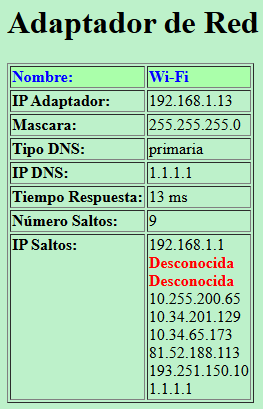

# DNS OptimizerXML - Análisis y Reporte de Adaptadores de Red en C

Este proyecto es una evolucion del proyecto [DNS_optimizer](https://github.com/CarrasDev/DNS_optimizer) que permite al usuario seleccionar un adaptador de red de su sistema, recopilar información detallada sobre él y generar un archivo XML con los datos obtenidos.
La aplicación utiliza comandos del sistema como `netsh`, `ping` y `tracert` para obtener información relevante sobre la configuración de red y el rendimiento del adaptador seleccionado.

## Características

*   **Listado y Selección de Adaptadores:** Muestra una lista de todos los adaptadores de red disponibles en el sistema y permite al usuario seleccionar uno para su análisis.
*   **Recopilación de Información de Red:**
    *   Obtiene la dirección IP, la máscara de subred y la puerta de enlace del adaptador seleccionado.
    *   Identifica los servidores DNS primario y secundario.
*   **Análisis de Rendimiento de DNS:**
    *   Calcula el tiempo medio de respuesta (ping) al servidor DNS primario.
    *   Realiza un `tracert` para determinar el número de saltos y las direcciones IP de cada salto hasta el DNS primario.
*   **Generación de Reporte XML:** Crea un archivo XML (`<nombre_del_adaptador>.xml`) que contiene toda la información recopilada, estructurada de forma clara.

## Estructura del Proyecto

El proyecto está organizado en los siguientes ficheros fuente:

*   [`main.c`](main.c): Contiene la función principal `main` que orquesta la ejecución del programa, llamando a las distintas funciones de análisis y generación de ficheros.
*   [`procesos.h`](procesos.h): Fichero de cabecera que define la estructura `AdaptadorRed` y declara las funciones principales para el procesamiento de datos de red.
*   [`procesos.c`](procesos.c): Implementa la lógica para interactuar con comandos del sistema como `netsh`, `ping` y `tracert`, y para procesar su salida para obtener la información del adaptador.
*   [`fun_aux.h`](fun_aux.h): Declara funciones auxiliares de utilidad general.
*   [`fun_aux.c`](fun_aux.c): Implementa funciones auxiliares como `limpiarBuffer` para limpiar el búfer de entrada y `limpiarBarraN` para eliminar saltos de línea de las cadenas.
*   [`xml_file.c`](xml_file.c): Contiene la función `crearXML` responsable de escribir los datos de la estructura `AdaptadorRed` en un fichero con formato XML.

## Requisitos

- Windows 10 o superior
- Permisos de administrador (para modificar la configuración de red)
- Visual Studio 2022 o compatible
- Conexión a Internet (para probar los servidores DNS)

## Cómo Compilar y Ejecutar

Este proyecto está configurado como una solución de Visual Studio (`.sln`).

1.  Abre el fichero [`Producto4.sln`](Producto4.sln) con Visual Studio.
2.  Selecciona una configuración de compilación (por ejemplo, `Debug` o `Release`).
3.  Compila el proyecto (F7 o Build > Build Solution).
4.  El ejecutable `Producto4.exe` se generará en el directorio `Debug/` o `Release/`.
5.  Ejecuta el programa desde la línea de comandos o directamente desde Visual Studio.

## Uso

Al ejecutar la aplicación:
1.  Se mostrará un menú con los adaptadores de red detectados.
2.  Introduce el número del adaptador que deseas analizar y presiona Enter.
3.  El programa realizará las comprobaciones (obtención de IP, ping, tracert) y mostrará el progreso en la consola.
4.  Al finalizar, se mostrará un resumen de los datos obtenidos en la consola.
5.  Se creará un archivo XML (p. ej., `Wi-Fi.xml`) en el directorio de ejecución con toda la información detallada.

### Ejemplo de Salida XML

El programa genera un fichero XML como [`documentacion/Producto5/adaptador.xml`](documentacion/Producto5/adaptador.xml), que puede ser transformado a HTML usando la plantilla [`documentacion/Producto5/plantilla.xsl`](documentacion/Producto5/plantilla.xsl) para una mejor visualización, como se muestra en [`documentacion/Producto5/output.html`](documentacion/Producto5/output.html).

## Créditos

Proyecto creado por:

- Daniel Carrasco ([CarrasDev](https://github.com/CarrasDev))

---

> Para cualquier duda o sugerencia, ponte en contacto o abre un issue en el repositorio.

¡¡Gracias por visitar mi proyecto!! 😊